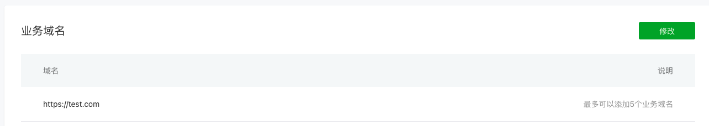

# 小程序DEMO

- 微信原生的方式开发小程序
- ./h5 为移动端web网页

## 目前功能

- H5和小程序web-view通信bridge

## 开发

1. 配置/private/etc/host 文件。

```
120.0.0.0 test.com
```

2. 微信申请测试号，并配置业务域名。



3. h5目录下 `npm run dev` 启动H5项目

4. 微信开发者工具打开项目